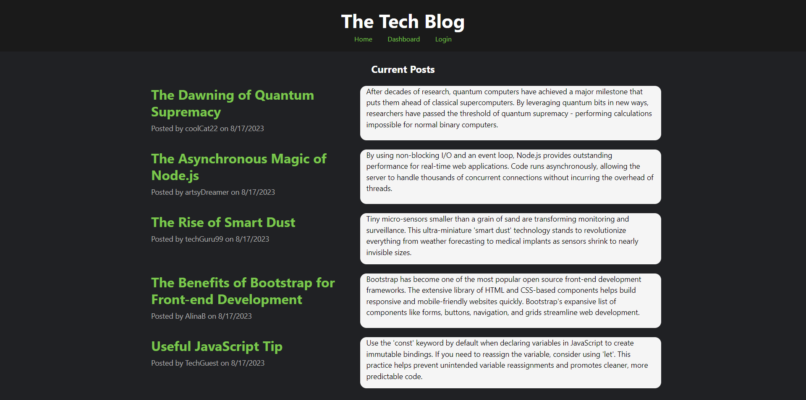
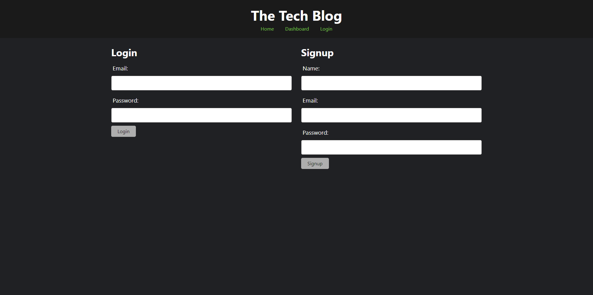
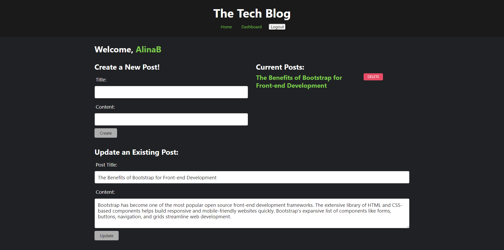

# MVC Tech Blog

[](https://opensource.org/licenses/MIT)


## Description
A CMS-style blog site following the MVC architectural pattern. This site allows users to create their own posts and engage in discussions on other users' content. But only logged-in users will be able to write and reply and also update and delete their posts. If you don't want to create an account you can just simply read other users' posts and comments.

You can find the site here: [Heroku deployed app](https://mvc-tech-blogab-928389db966f.herokuapp.com/)

## Table of Contents
- [Installation](#installation)
- [Usage](#usage)
- [Contributing](#contributing)
- [Credits](#credits)
- [License](#license)
- [Questions](#questions)

## Installation
Clone the repository.
```
git clone git@github.com:AlinaB108/MVC-tech-blog.git
```
Create package.json:
```
npm init -y
```
Install all dependencies from package.json:
```
npm i
```
The app uses dotenv (you need to use your own sql password)
```
npm i dotenv 
```

## Usage
Start mySQL in an integrated terminal
``` 
mysql -u root -p
```
Then execute SQL statements from a file
```
SOURCE ./db/schema.sql
```
Quit MySQL and then seed the database
```
node ./seeds/seed.js
```
Start the server
```
node server.js
```








## Contributing
1. Fork the project by clicking Fork in the top-right corner of the page.
2. Clone the repository.
3. Create a new branch to work on.
4. Commit the changes.
5. Push to the branch.
6. Create a pull request.

## Credits
The code is based on the code featured in the mini-challenge(Module 14) of UT Coding Bootcamp.
Database information (usernames and posts) is generated by ChatGPT.

## License
[](https://opensource.org/licenses/MIT)

https://opensource.org/licenses/MIT 
    
## Questions
If you have any questions, send me a message [GitHub](https://github.com/AlinaB108) or send me an email: [alinachristabel108@gmail.com](alinachristabel108@gmail.com)
